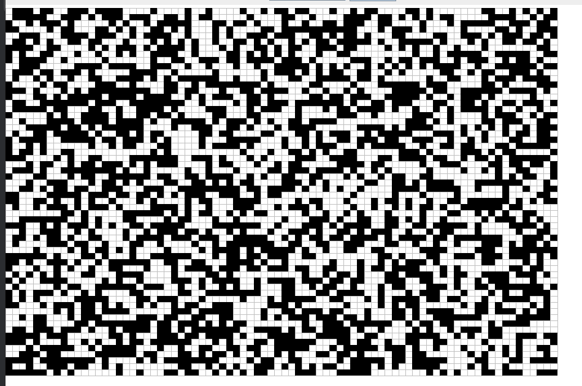
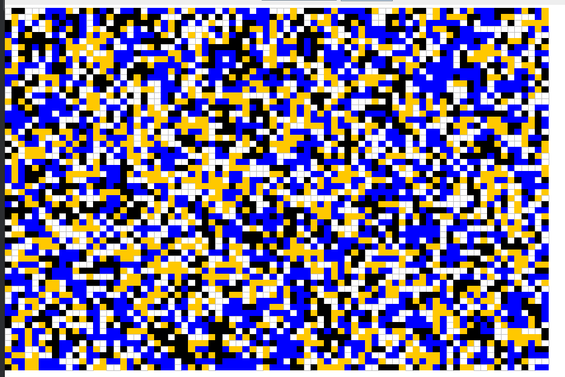

# Lab12 – Wizualizacja automatów komórkowych z dynamicznym ładowaniem skryptów JavaScript

## 🧠 Cel projektu

Celem projektu jest stworzenie aplikacji w języku Java, która umożliwia **wizualizację działania automatów komórkowych**, przy czym logika automatów jest definiowana w **dynamicznie ładowanych skryptach JavaScript**.

Projekt demonstruje:
- Współpracę między maszyną wirtualną Javy a silnikiem JavaScript (Nashorn).
- Możliwość rozszerzania programu bez rekompilacji (poprzez skrypty).
- Działanie dwóch znanych automatów: **Gra w życie** i **Wireworld**.

## 🚀 Jak uruchomić projekt

### 1. Wymagania:
- Java JDK 21 (lub inna wersja z obsługą Nashorn)
- Maven (`mvn`) lub IDE (np. IntelliJ IDEA)

### 2. Uruchomienie z IDE:
1. Otwórz projekt w IntelliJ / Eclipse.
2. Ustaw klasę startową:
   ```
   pl.e_science.git.ivahan0788.Main
   ```
3. Uruchom aplikację (`Run`).

## 🖱️ Obsługa aplikacji

Po uruchomieniu aplikacji pojawi się GUI z panelem kontrolnym:

### 📌 Górny pasek zawiera:
- **Wybór automatu** z rozwijanej listy (`Game of Life`, `Wireworld`).
- **Przycisk Start/Pause** – zatrzymuje lub wznawia symulację.

### 🟦 Siatka komórek:
- Kolor komórki zależy od jej stanu (różne dla każdego automatu).
- Można **kliknąć myszą**, aby zmieniać stan komórki **(gdy symulacja jest zatrzymana)**.

## 📜 Automaty dostępne w projekcie

### 1. Game of Life (Gra w życie)
- Stan 0 – martwa komórka (szary obrys)
- Stan 1 – żywa komórka (czarna)

Zasady zgodne z [Conway's Game of Life](https://pl.wikipedia.org/wiki/Gra_w_%C5%BCycie)

### 2. Wireworld
- Stan 0 – puste (szary)
- Stan 1 – głowa elektronu (czarny)
- Stan 2 – ogon elektronu (pomarańczowy)
- Stan 3 – przewodnik (niebieski)

Zasady zgodne z [Wireworld](https://pl.wikipedia.org/wiki/Wireworld)

## 🖼️ Zrzuty ekranu

### 🔄 Game of Life – Symulacja


### ⚡ Wireworld – Liniowy przewodnik


